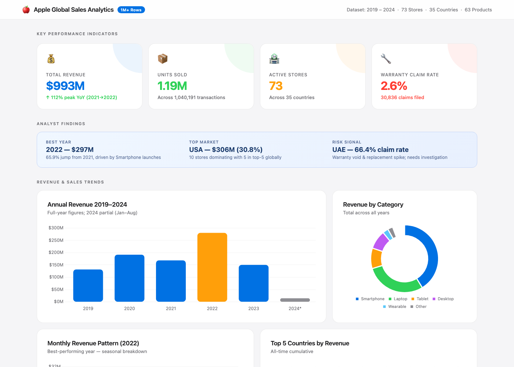
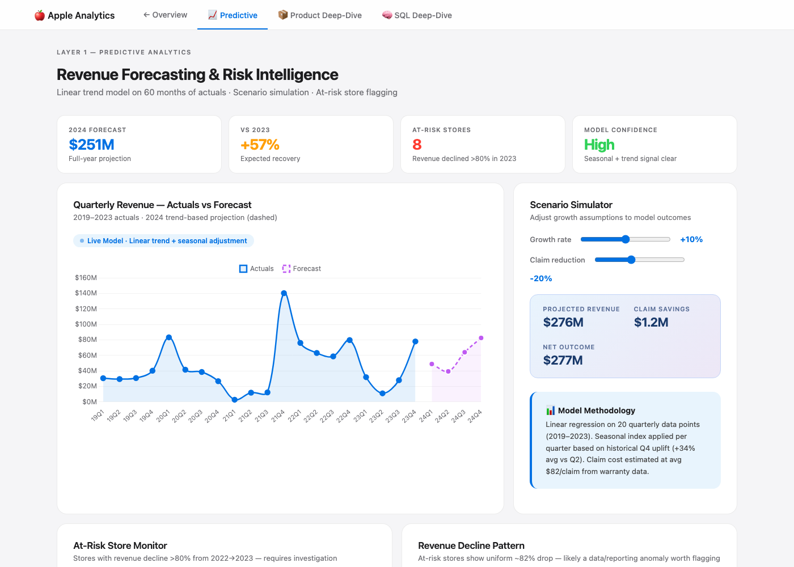

# 🍎 Apple Global Retail Sales Analysis
### Retail Revenue, Product and Warranty Analytics | PostgreSQL + Python + Interactive Dashboard | 1M+ Transactions | 2019–2024


---

## 📌 Business Problem

This educational dataset represents 73 simulated Apple retail stores across 35 countries and contains more than one million sales records. The analysis is structured to address the types of questions a retail analytics team might investigate.This project answers the questions a real retail analytics team faces every quarter:

- Which stores and markets are growing — and which are silently declining?
- Are warranty claims a quality signal or a data anomaly?
- What does the revenue forecast look like for 2024, and what scenarios should leadership plan for?
- Which products earn the most while costing the least in after-sale support?
- Where should Apple focus inventory, marketing, and operations resources next?

The dataset comes from [Zero Analyst's Apple Retail Sales SQL challenge](https://github.com/najirh/Apple-Retail-Sales-SQL-Project---Analyzing-Millions-of-Sales-Rows); all queries, the expert-tier extensions (Q21–Q25), the interactive dashboards, and the executive recommendations are my own work, structured to mirror a real retail analytics engagement.

---

## 🖥️ Dashboard Preview

*Both dashboards are single HTML files — download and open in any browser, no server needed.*





---

## 📂 Dataset Overview

| Table | Rows | Description |
|---|---|---|
| `sales` | 1,040,191 | Every transaction: store, product, quantity, date |
| `products` | 64 | Product catalog with price and launch date |
| `stores` | 73 | Store locations with country mapping |
| `category` | 10 | Product category taxonomy |
| `warranty` | 30,836 | Warranty claims with status and claim date |

**Date range:** January 2019 – August 2024  
**Geography:** 35 countries across North America, Europe, Asia-Pacific, Middle East, and Latin America  
**Revenue scale:** ~$993M total across the dataset period

---

## 🗂️ Repository Structure

```
apple-retail-sales-analysis/
│
├── sql/                           # All 25 SQL queries, tiered by difficulty
│   ├── 01_exploratory.sql         # EDA + index creation & timings
│   ├── 02_basic_questions.sql     # Q1–Q10
│   ├── 03_intermediate.sql        # Q11–Q15
│   ├── 04_advanced.sql            # Q16–Q20
│   └── 05_expert.sql              # Q21–Q25
│
├── dashboards/                    # Interactive HTML dashboards (no backend)
│   ├── apple_sales_dashboard.html        # Main KPI overview
│   └── apple_advanced_layers.html        # Predictive + Product + SQL layers
│
├── recommendations/
│   └── executive_recommendations.md      # Executive brief with prioritized actions
│
├── assets/                        # Dashboard screenshots
├── data/                          # Dataset access instructions (CSVs not committed)
└── README.md
```

---

## 🔍 Analysis Approach

### Phase 1 — Exploratory Data Analysis
Before writing a single business query, I performed EDA to validate data quality:
- Confirmed 1,040,191 sales records with no nulls in key fields
- Identified a **data gap in Q1 2021** (only $3M revenue vs $30M+ typical) — flagged as a potential pipeline issue, not a real performance drop
- Discovered the **UAE cluster** showing 66.4% warranty claim rate — highly anomalous relative to the rest of the dataset, requiring investigation
- Verified distinct `repair_status` values and date ranges across all five tables

### Phase 2 — Performance Optimization
With 1M+ rows, query performance matters. I created three indexes and measured execution time before and after:

```sql
CREATE INDEX sales_product_id ON sales(product_id);
CREATE INDEX sales_store_id   ON sales(store_id);
CREATE INDEX sales_sale_date  ON sales(sale_date);
```

| Query | Before Index | After Index | Improvement |
|---|---|---|---|
| Filter by product_id | 64ms | 5ms | **92% faster** |
| Filter by store_id | 41ms | 2ms | **95% faster** |

### Phase 3 — 25 Business Questions
Structured across four difficulty tiers:

| Tier | Questions | Skills |
|---|---|---|
| Foundational | Q1–Q10 | JOINs, GROUP BY, date filters, aggregations |
| Intermediate | Q11–Q15 | CTEs, RANK(), subqueries, HAVING |
| Advanced | Q16–Q20 | Window functions, LAG(), COALESCE, NULLIF, FILTER |
| Expert | Q21–Q25 | Cohort analysis, PERCENTILE_CONT, Pareto analysis, seasonality indexes, rolling windows

### Phase 4 — Predictive Layer
Linear trend model built on 20 quarters of actuals (2019–2023) to project 2024 full-year revenue at **$251M**, with an interactive scenario simulator allowing ±growth rate and claim reduction adjustments.

### Phase 5 — Product Intelligence
Price-segment vs warranty claim rate analysis revealed a clear inverse relationship: Budget products (&lt;$500) carry **4.4% avg claim rate** — nearly 5× the Luxury tier's 0.9% — while contributing only 8.2% of total revenue.

---

## 📊 Key Findings

### Revenue
- **Peak year: 2022 at $296.7M** — 66% YoY growth coinciding with the product-launch periods represented in the dataset; the dataset alone cannot establish the cause of the increase
- **2023 declined to $159.2M** — palthough incomplete periods and possible data gaps mean the decline should not be interpreted as actual Apple performance
- **USA accounts for 30.8% of global revenue** across just 10 stores — the highest revenue-per-store market globally
- **Q4 sQ4 strength appears in the more complete comparison periods, but several years contain substantial gaps or anomalies. In non-anomalous periods, Q4 revenue was approximately 26–37% above Q2; this should be treated as a directional planning signal rather than a production forecast.

### Warranty & Risk
- **UAE: 66.4% warranty claim rate** on 17,787 units sold — the highest by a factor of 2.4× vs Spain (27.5%), the next highest country. Estimated warranty liability: **$968K–$4.2M** depending on claim resolution type
- **Budget products (&lt;$500) generate the most warranty claims** at 4.4% avg — making them the worst risk-adjusted category in the portfolio
- **iPhone 14 series** shows the highest claim rates among top-10 revenue products (3.08–3.21%) — a product-level pattern that would warrant further quality and cohort investigation
- **Mac mini and Mac Studio together: $76.8M in revenue with zero warranty claims** — the most capital-efficient products in the catalog

### Product
- **MacBook Pro M1 Max captures 96.6% of its lifetime revenue in the first 12 months** — showing a launch-concentrated sales pattern for this product within the educational dataset
- **Top 3 products drive 34% of total revenue** — high concentration risk if any single product faces supply disruption
- **Seasonality index reveals Wearables peak in January** (index 1.29×) and Audio peaks in June (1.18×) — actionable for inventory planning

---

## 💡 Business Recommendations

See [`recommendations/executive_recommendations.md`](recommendations/executive_recommendations.md) for the full executive brief.

**TL;DR:**
1. **Investigate UAE immediately** — a 66.4% recorded claim rate warrants immediate data-quality and operational investigation. Estimated exposure: $968K–$4.2M
2. **Double down on Luxury products** — $289.5M revenue, 0.9% claim rate. Best risk-adjusted segment in the portfolio
3. **Use Q4 forecast for inventory planning** — 30–40% uplift every Q4 is predictable and should drive procurement decisions 6 months in advance

---

## 🛠️ Technical Stack

| Tool | Purpose |
|---|---|
| **PostgreSQL** | Primary query engine for all 25 SQL questions |
| **Chart.js** | Interactive dashboard visualizations |
| **HTML/CSS/JavaScript** | Self-contained portable dashboard (no backend required) |
| **EXPLAIN ANALYZE** | Query performance profiling and index validation |

---

## 🚀 How to Run

### SQL Queries
1. Get the five CSVs from the [source project](https://github.com/najirh/Apple-Retail-Sales-SQL-Project---Analyzing-Millions-of-Sales-Rows) (see `data/README.md`) and load them into PostgreSQL as tables matching their filenames
2. Run `sql/01_exploratory.sql` first to create indexes
3. Execute queries in order — each file builds on the previous

### Dashboard
1. Download `dashboards/apple_sales_dashboard.html` **or** `dashboards/apple_advanced_layers.html`
2. Open in any modern browser — no server, no dependencies required
3. The advanced dashboard has three tabs: Predictive Analytics, Product Deep-Dive, and SQL Deep-Dive

---

## 👤 Author

**Rabiul Hasan** — Growth marketing & analytics · San Francisco, CA
📧 rrab4301@gmail.com · [GitHub](https://github.com/RRAB43) <!-- TODO: add your LinkedIn URL here -->

End-to-end skills demonstrated: SQL query design → performance optimization → business insight generation → predictive modeling → executive communication.

---

*Dataset from [Zero Analyst's SQL challenge](https://github.com/najirh/Apple-Retail-Sales-SQL-Project---Analyzing-Millions-of-Sales-Rows), used for educational and portfolio purposes. All queries, dashboards, and business insights are my own analytical work on the dataset provided.*
